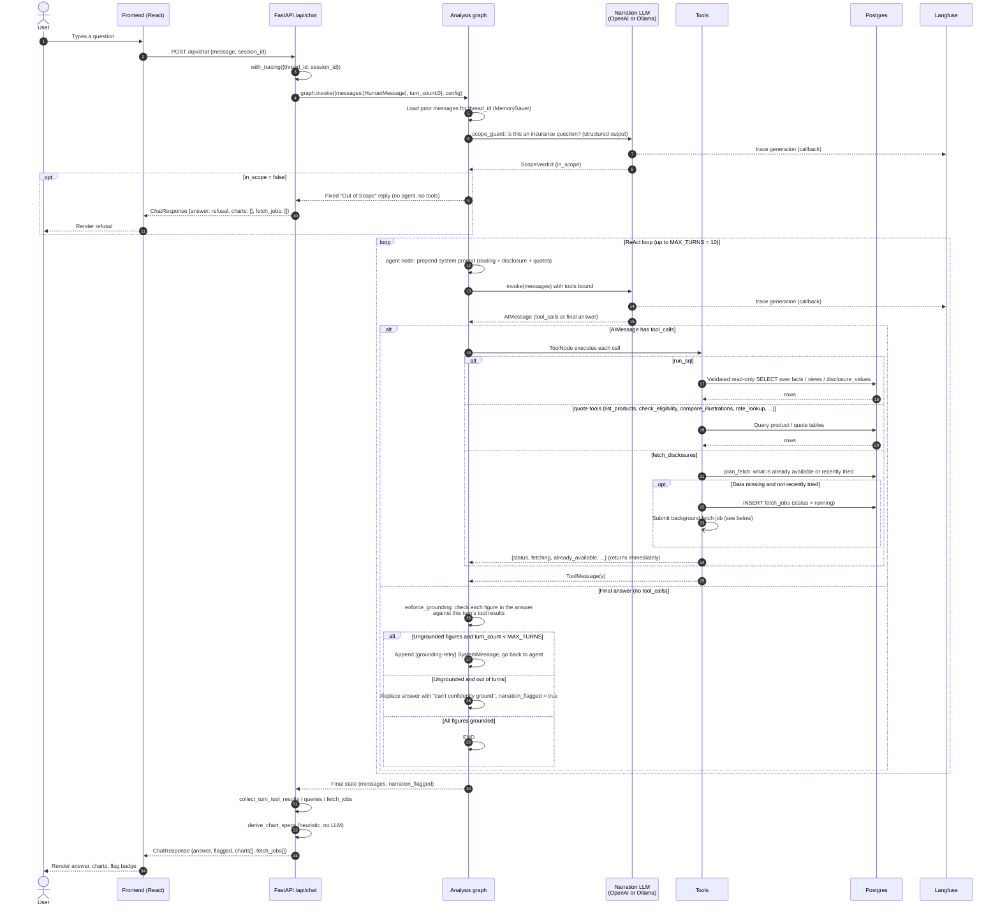
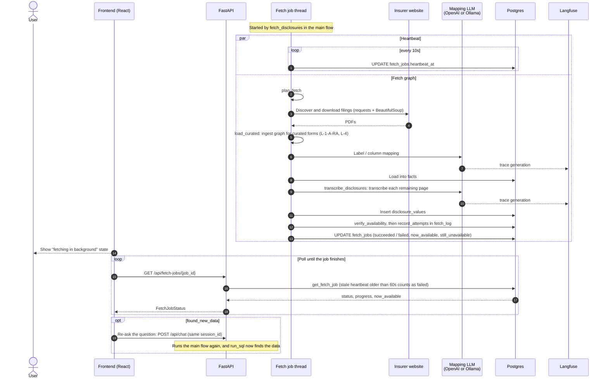

# Chat request sequence

What happens when someone asks the bot a question in the web UI: from the browser, through
`POST /api/chat`, the analysis graph's ReAct loop and grounding check, to the response. If
data is missing, a background fetch job also runs and the browser polls it.

Participants:

- **Frontend**: the React chat UI ([frontend/](../frontend/)), served by Vite with `/api` proxied to the API.
- **API**: FastAPI app ([api.py](../src/irdai_bot/api.py)). It builds the analysis graph once at import time.
- **Analysis graph**: [graphs/analysis_graph.py](../src/irdai_bot/graphs/analysis_graph.py). Nodes are `agent`, `tools` and `enforce_grounding`. Turn state is kept in a `MemorySaver` keyed by `session_id`.
- **Narration LLM**: `NARRATION_MODEL`, which is OpenAI or `ollama:<model>` ([llm.py](../src/irdai_bot/llm.py)).
- **Tools**: `run_sql`, `fetch_disclosures` and the quote tools ([nodes/analysis/tools.py](../src/irdai_bot/nodes/analysis/tools.py), [nodes/quotes/tools.py](../src/irdai_bot/nodes/quotes/tools.py)).
- **Postgres**: the facts warehouse, metric views, `disclosure_values`, the product tables and `fetch_jobs`.
- **Fetch job**: a background thread running the fetch graph ([fetch.py](../src/irdai_bot/fetch.py), [graphs/fetch_graph.py](../src/irdai_bot/graphs/fetch_graph.py)).
- **Langfuse**: traces every LLM call through the callback handler that `with_tracing()` attaches ([observability.py](../src/irdai_bot/observability.py)).

## Main flow

## Background fetch, when `fetch_jobs` is non-empty

The chat reply has already been returned. The fetch job keeps running on a thread inside the
API process while the frontend polls it.

## Notes

- **Session memory** lives in process. `MemorySaver` keeps a session's messages across chat
  turns, but they are lost when the server restarts.
- **Tracing** applies to both models. The Langfuse callback rides on the ambient
  `RunnableConfig`, so OpenAI and Ollama calls are traced the same way. This includes calls
  made on the fetch job's worker threads, because of `contextvars.copy_context()`.
- **Steps that use no LLM**: SQL validation, the grounding check, chart derivation and PDF
  layout extraction are all deterministic.
